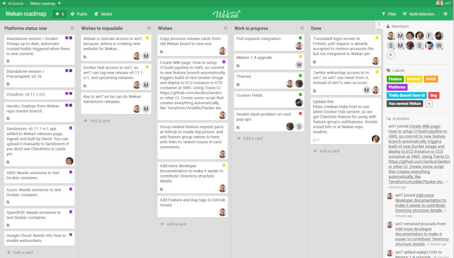

# Wekan for Yunohost

Wekan is an open-source kanban board (task manager and organizer)

  

**Shipped version:** 2.09

## Screenshot

## Status

- This app only works on x86, 64bits architecture ! In particular, it won't work on 32 bit machines or ARM. See the discussion [here](https://github.com/YunoHost-Apps/wekan_ynh/issues/1#issuecomment-401612500). On the long term, [support for ARM64 might happen](https://blog.wekan.team/2018/01/wekan-progress-on-x64-and-arm/index.html)...

- There is currently no SSO/LDAP integration though it might be integrated at some point in the app, now that it's supported in Meteor/Wekan. c.f. discussion in [here](https://github.com/YunoHost-Apps/wekan_ynh/issues/4). In the meantime, users can create accounts (in fact, they can create infinite number of accounts) manually, and need to login manually specifically in Wekan.

## Infos

**Package by:** ljf & Aleks
**Categories:** Productivity, Task

**Upgrade this package:**  
`sudo yunohost app upgrade --verbose wekan -u https://github.com/YunoHost-Apps/wekan_ynh`

**Multi-user:** Yes. 

**Private/Public mode:** In private mode, only authorized YunoHost members can access to the wekan. 

**SSO/LDAP:** SSO and LDAP are not configured.
